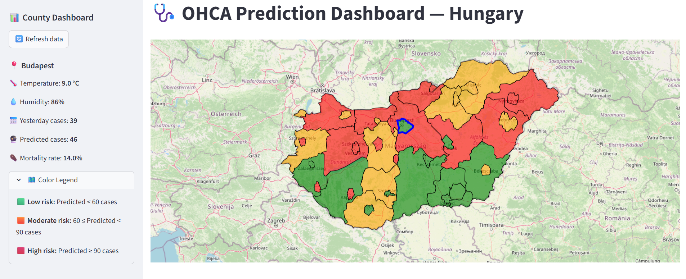

# 🩺 OHCA Prediction Dashboard — Hungary

An interactive web dashboard for visualizing predicted Out-of-Hospital Cardiac Arrest (OHCA) cases across the counties of Hungary. This application uses a machine learning model  to provide daily predictions and displays them on a color-coded, interactive map.

## 📸 Preview

Below is an example of how the full OHCA dashboard looks when running:




## 🚀 Getting Started

Follow these instructions to set up and run the dashboard on your local machine.

### Prerequisites

-   Python 3.8+

### 1. Clone the Repository
⚠️ **Important:**
You must **clone** this repository using Git instead of downloading it as a ZIP file from the GitHub website.

If you download the repository manually, Windows may modify the line endings (`\r\n`) in the `setup_and_run.bat` file, causing it to break (e.g., `'delayedexpansion' is not recognized` or similar errors).

Use this command instead:

```bash
git clone https://github.com/your-username/OHCA_HU_Website.git
```

This ensures the batch file keeps its correct line endings and works properly on Windows.

### 2. Set up back end and front end.

- Run `setup_and_run.bat` — this will set up both the frontend and backend environments and install all necessary dependencies.


Open your web browser and navigate to `http://localhost:8501`.
